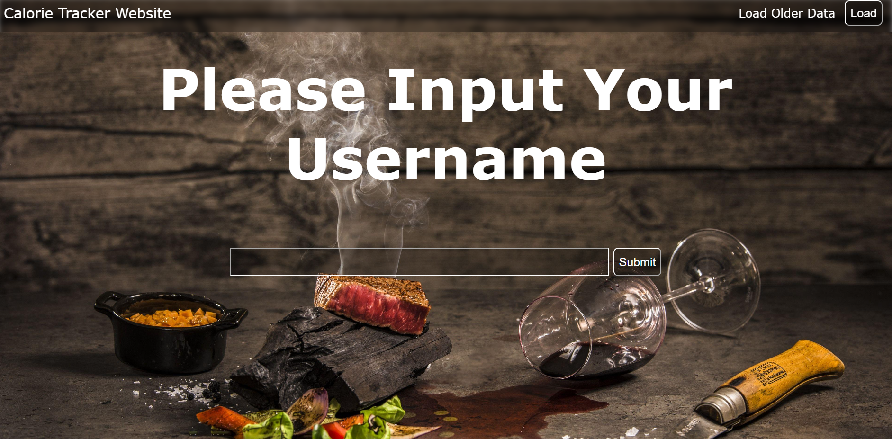

# Calorie Tracker  

A simple and interactive **Calorie Tracking Web Application** designed to help users monitor daily calorie intake and manage healthier eating habits.  

🔗 **Live Demo:** [Calorie Tracker](https://julianmoodie.github.io/Calorie-Tracker/)  

---

## 📌 Overview  

The **Calorie Tracker** was built as a team project to demonstrate JavaScript, HTML, and CSS fundamentals while incorporating user interaction and dynamic data management.  

### 🎯 Purpose  
- Help users log and track calories consumed.  
- Provide a simple, user-friendly interface for managing meals.  
- Raise awareness of healthier eating through visual data and tracking.  

### 👥 Target Audience  
- Students and professionals wanting a lightweight tool for daily calorie tracking.  
- Beginners learning calorie awareness.  
- Anyone looking for a simple alternative to large, complex fitness apps.  

---

## ✨ Features  

✅ Add meals with calorie amounts.  
✅ Delete or edit meals.  
✅ Calculate and display total calories consumed.  

---

## 🖼️ Screenshots  

  

Here is a short demo showcasing the functionality of the key features implemented in our project so far:

https://streamable.com/0l8dx1

Here is our final video where we each go over our contributions to the project:

